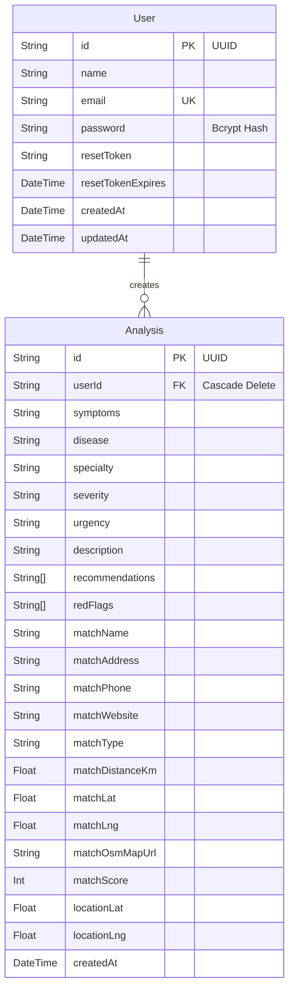

# 🏥 MediFind — Detailed Technical Project Description

This document provides a comprehensive technical breakdown of **MediFind**, a mobile-first, full-stack health-tech application that performs AI-assisted symptom analysis and matches patients with appropriate, nearby medical specialists.

---

## 🗺️ System Architecture Overview

MediFind is built as a layered monorepo consisting of a **React SPA frontend** (with Capacitor native wrappers) and an **Express.js backend REST API**, backed by a **PostgreSQL database** (hosted on Neon) and a **Redis cache** (with in-memory fallbacks).

```
                      +------------------------------------------+
                      |               USER DEVICE                |
                      |                                          |
                      |  +------------------------------------+  |
                      |  |     Frontend React Client (SPA)    |  |
                      |  |                                    |  |
                      |  |   [ Zustand Store ]   [ Pages / UI]|  |
                      |  |   (authStore.js)      (Framer-Mot) |  |
                      |  +-----------------+------------------+  |
                      |                    |                     |
                      |                    v                     |
                      |  +-----------------+------------------+  |
                      |  |  Client-Side localStorage Cache    |  |
                      |  +-----------------+------------------+  |
                      +--------------------|---------------------+
                                           | HTTPS REST Calls
                                           | (Axios Client, JWT)
                                           v
                      +--------------------+---------------------+
                      |             BACKEND SERVER               |
                      |            (Express.js / Node)           |
                      |                                          |
                      |  +------------------------------------+  |
                      |  |       Express Middleware Stack     |  |
                      |  |  (helmet, cors, rate-limit, cookie)|  |
                      |  +-----------------+------------------+  |
                      |                    |                     |
                      |                    v                     |
                      |  +------------------------------------+  |
                      |  |       API Routers & Controllers    |  |
                      |  |   /auth, /analyze, /find-doctor,   |  |
                      |  |   /history, /health                |  |
                      |  +--------+--------+--------+---------+  |
                      |           |        |        |            |
                      +-----------|--------|--------|------------+
                                  |        |        |
         +------------------------+        |        +-------------------------+
         v                                 v                                  v
+------------------+             +--------------------+            +-------------------+
|  PostgreSQL DB   |             |    Cache Layer     |            |   External APIs   |
|   (via Prisma)   |             | (Redis/Mem fallbk) |            |                   |
|  - User Tables   |             +--------------------+            | - Google Gemini   |
|  - Analysis Rows |                                               | - OSM Overpass    |
+------------------+                                               | - Nominatim / IP  |
                                                                   +-------------------+
```

### End-to-End Data Flow (Analysis & Matching)
1. **Symptom Input**: The user enters symptoms in free text on the client interface.
2. **Analysis Request**: The React client triggers a `POST /api/analyze` request.
   - **Cache Lookup**: The backend checks Redis/in-memory Map for matching symptom keys to avoid expensive AI processing.
   - **Concurrency Limit**: If uncached, the request passes through the **Gemini Queue** (12 RPM token-bucket).
   - **Model Cascade**: The backend executes a cascade sequence to contact the Google Gemini API (trying `gemini-2.0-flash` -> `gemini-2.0-flash-lite` -> `gemini-2.5-flash-lite-preview`).
   - **Local Fallback**: If all Gemini endpoints fail, a **local 45-disease keyword scoring engine** triggers to guarantee a response.
   - **Post-Processing Checkers**:
     - *India Tropical Pattern Check*: If symptoms map closely to tropical diseases (e.g. Dengue, Malaria, Typhoid), severity levels are auto-bumped, specialties overridden, and local conditions inserted into the differential diagnosis.
     - *Medicine Stripper*: Blacklisted medication terms (e.g. Ibuprofen, Paracetamol, Antibiotics) are deleted from recommendations and replaced with a prompt to consult a physician, reducing self-medication risk.
   - **Persistence & Caching**: The final cleaned response is stored in the database, cached in Redis/memory, and returned to the client.
3. **Location Acquisition**: The client obtains GPS coordinates (using HTML5 Geolocation API, falling back to Capacitor native GPS, then to an IP-based service `ipapi.co` if GPS fails, or a Nominatim city geocoder).
4. **Doctor Matching**: The client triggers a `POST /api/find-doctor` with coordinates and the recommended specialty.
   - **Map Query**: The backend queries the **OpenStreetMap Overpass API** within a 5km radius (expanding to 15km if empty) for `hospital`, `clinic`, or `doctors` elements.
   - **Multi-Factor Scoring**: Facilities are ranked using an algorithm combining Haversine distance, specialty tag alignment, facility type, and metadata completeness.
   - **Sync & Return**: The best matching facility is appended to the analysis database row and returned to the client to render the interactive doctor card.

---

## ⚙️ Core Algorithms & Decision Engines

### 1. Gemini Model Cascade & Rate Limiter Queue
To guarantee high-speed, cost-effective, structured JSON replies under high traffic or API instability, the backend applies two mechanics:
* **Token-Bucket Queue (`geminiQueue.js`)**: Caps requests to **12 RPM** (below the free tier limit of 15 RPM). When the token count is `< 1`, incoming requests are pushed to a FIFO queue and resolved when tokens regenerate (at `12 / 60` tokens per second). Quoted requests time out after 30 seconds, returning a `503` status.
* **Cascade Sequence**: If an API call fails or times out (7s per-call limit, 22s total deadline limit), the server falls back automatically:
  1. `gemini-2.0-flash` (Best quality, 15 RPM)
  2. `gemini-2.0-flash-lite` (Higher throughput, 30 RPM)
  3. `gemini-2.5-flash-lite-preview-06-17` (Preview headroom)
  4. Local Engine (Offline-fallback)

### 2. Local Fallback Keyword Matching (`localDiagnosis.js`)
If external APIs fail, the local keyword matching engine scores the input symptom string against 45 diseases (structured under `backend/utils/diseases/` in category files):
* **Word-Boundary Validation**: Keywords are checked with padded spacing to avoid partial matches (e.g. matching "flu" inside "fluid" or "ear" inside "fear").
* **Scoring Formula**:
  $$\text{Raw Score} = \left(\frac{\text{Matched Keywords}}{\text{Total Keywords}} \times \text{Base Confidence}\right) - (\text{Matched Negatives} \times 8)$$
* **Constraints**:
  - Requires at least one symptom from the `required` array.
  - Requires ALL symptoms from the `requiredAll` array (if configured).
  - Disqualifies the match if $\ge 2$ negative symptoms match.
  - Caps confidence scores at a conservative **82%**.

### 3. India-Prevalent Disease Pattern Validator (`indianDiseasePatterns.js`)
Tropical, epidemic-prone, and endemic diseases in India have distinct symptom clusters. The backend cross-checks both AI and local diagnoses against 96 predefined India-specific patterns:
* **Detection**: If a symptom matches $\ge 2$ keywords in a pattern group (e.g. high fever, chills, joint pain, rash), it triggers.
* **Overrides**:
  - If a pattern match count is $\ge 3$ and its specialty differs from the diagnosed specialty, the engine forces the specialty to override (e.g. switching from "neurologist" to "general physician" for viral fever/dengue symptom mismatches).
  - Adjusts severity from "mild" to "moderate" if tropical patterns signal severe indicators.
  - Appends the tropical disease (e.g. Typhoid, Chikungunya) to the front of the `differentialDiagnosis` list.

### 4. Safety Sanitation: Medicine Stripper
To maintain safety standards and avoid prescribing medicines via AI:
* **Blacklist Filtering**: The server sweeps the `recommendations` array against `MEDICINE_TERMS` (including NSAIDs, antibiotics, antihistamines, dosage indicators like "mg", "tablets", and prescribing phrases).
* **Action**: Any line matching is stripped out. A general message is appended: *"Consult a [specialty] for appropriate medication and dosage — do not self-medicate."*

### 5. Geolocation Doctor Matcher & Scorer (`ranking.js`)
When OSM coordinates are fetched, the server scores them out of **100 points** to find the single best provider match:
* **Distance Score (40% Weight - Max 40 Points)**:
  - Calculated using the Great-Circle Haversine Formula:
    $$d = 2 R \arcsin\left(\sqrt{\sin^2\left(\frac{\Delta \text{lat}}{2}\right) + \cos(\text{lat}_1)\cos(\text{lat}_2)\sin^2\left(\frac{\Delta \text{lng}}{2}\right)}\right)$$
  - Under 5km: $\text{Score} = \left(\frac{5 - d}{5}\right) \times 20 + 20$ (smooth curve from 20 to 40).
  - 5km to 12km: $\text{Score} = \left(\frac{12 - d}{7}\right) \times 20$.
  - Beyond 12km: 0 points.
* **Specialty Match (35% Weight - Max 35 Points)**:
  - Compares facility name and OpenStreetMap tags against positive/negative keywords matching the specialty.
  - Matches positive keyword: 35 points.
  - General hospital with medical college/GH indicators: 25 points.
  - Generic hospital: 18 points.
  - Generic clinic: 10 points.
  - Wrong specialty tags (e.g. dental clinic when looking for cardiologist) results in **immediate disqualification**.
* **Facility Type (15% Weight - Max 15 Points)**:
  - Hospital: 15 points.
  - Clinic: 10 points.
  - Doctor's chamber: 8 points.
* **Completeness Bonus (10% Weight - Max 10 Points)**:
  - Has phone number: +5 points.
  - Has street address: +3 points.
  - Has opening hours listed: +2 points.

---

## 🗄️ Database Architecture

The application uses **Prisma ORM** mapping onto a **PostgreSQL** schema:



### Database Optimization & Indexing
* **User Lookup Index**: Index set on `User(email)` for fast credential matching during login.
* **Analysis Cursor Index**: Compound index set on `Analysis(userId, createdAt DESC)` for fast pagination on history listings.

---

## 📱 Mobile & Frontend Tech Stack

MediFind operates as a Hybrid Native Application using **Capacitor CLI**:
* **Native Wrappers**: Capacitor maps the built React assets (the HTML/JS bundle in `/dist`) into native Android (running Java/Kotlin webviews via Gradle build configurations).
* **Cross-Platform Storage**: Dual-writes user history. Saves instantly to native `localStorage` for offline resiliency, then syncs to the backend REST API if a connection is active.
* **Location Orchestrator (`locationService.js`)**:
  - Tries high-accuracy browser HTML5 Geolocation API with a 5-minute cache wrapper.
  - If web sandbox permissions block access, requests native device location permissions via `@capacitor/geolocation`.
  - Fallback 1: Queries IP-based locator service (`ipapi.co`).
  - Fallback 2: Allows text-based city lookup geocoded through OSM Nominatim API.
* **Styling & UI**: Tailwind CSS coupled with Framer Motion transitions (faded sliding cards, pulsing loader overlays, and micro-interactions) to deliver an iOS/Android native feel.

---

## 🔒 Security & Performance Configurations

### 1. Dual-Mode Authentication
* **Web Client**: Authenticated sessions are secured using **HttpOnly, SameSite=Strict cookies** (`mf_token`). This shields tokens from client-side script inspection, mitigating Cross-Site Scripting (XSS) risks.
* **Capacitor/Mobile Client**: Because webviews on older Android platforms occasionally restrict cookie management, the client reads the token directly from the JSON body during authentication, caches it locally, and sends it via standard `Authorization: Bearer <JWT>` request headers.

### 2. Network Optimizations
* **Gzip Compression**: Backend applies `compression()` middleware to reduce the transfer payload size.
* **Axios Keep-Alives**: The frontend Axios client uses a 30s timeout matching a custom 28s server socket timeout to prevent unexpected closed sockets.
* **Cache Expiry (LRU)**: Redis keys are set with a **3-minute TTL** (time-to-live) for symptoms. Under high load or Redis outages, the system falls back to a memory-capped `Map` holding 500 records maximum.
